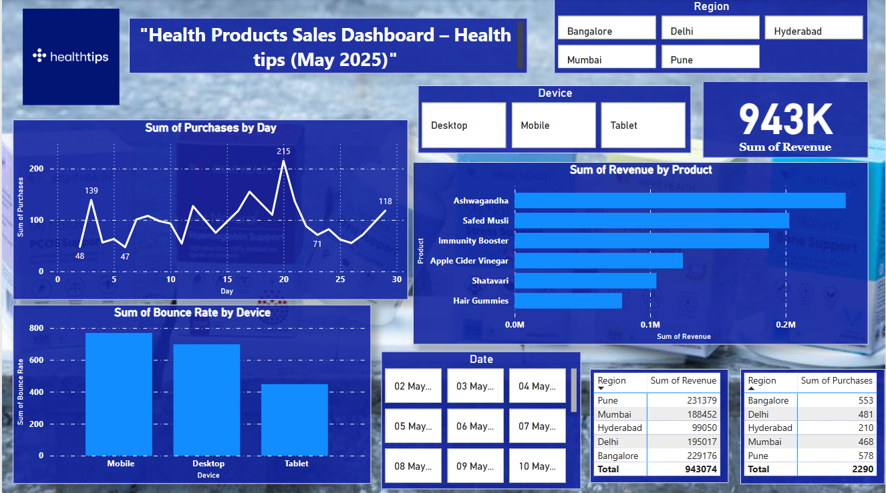
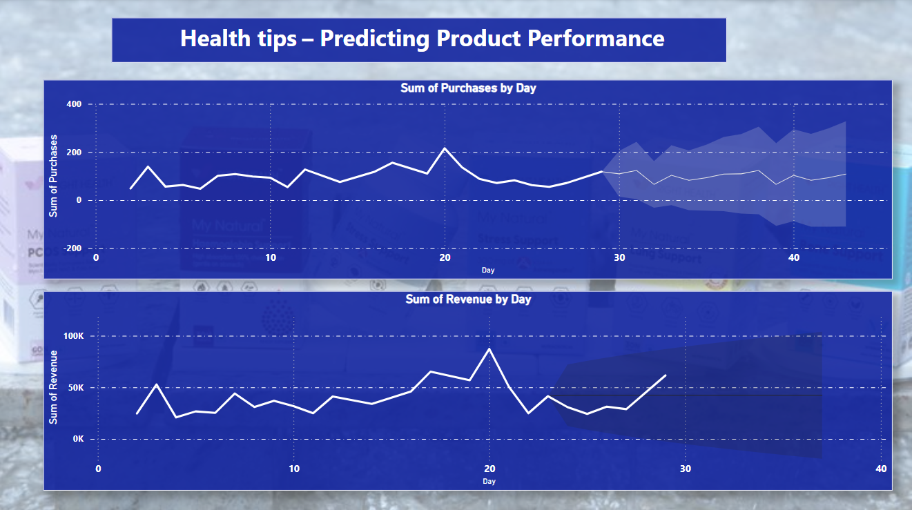

# PowerBI-HealthTips-Dashboard
Portfolio dashboards on product sales &amp; forecasting
# 📊 HealthTips – Power BI Dashboard Portfolio

This repository showcases interactive dashboards created using Power BI to visualize health product sales and predict performance using time series analysis.

---

## 🔹 Dashboard 1: Product Sales & Traffic – May 2025

**Objective:**  
Analyze sales trends, device-based bounce rates, and revenue performance for HealthTips product campaigns in May 2025.

**Key Features:**
- 📍 Region-wise revenue and purchase comparison
- 📈 Purchases by day with spikes and trends
- 💻 Bounce rate by device (Mobile, Desktop, Tablet)
- 🔎 Slicers by region, device, and date

**Tools Used:**  
Power BI, DAX, Excel, CSV Data

---

## 🔹 Dashboard 2: Predicting Product Performance

**Objective:**  
Forecast daily revenue and purchases to guide inventory and marketing strategies.

**Key Features:**
- 📊 Purchase & revenue trends visualized with confidence intervals
- 📅 40-day forecast horizon
- 📌 Time-based product insights

**Tools Used:**  
Power BI, DAX, Time Intelligence, Excel

---

## 📝 Notes

- This is a portfolio project using **mock data** created for demonstration and educational purposes.
- Not affiliated with any real brand.

---

## 👩‍💻 About Me

I'm Heena Shaikh, a passionate data science student and  data analyst with expertise in Power BI, Excel, Python, and automation tools.

📧 Contact: heenashaikh200410@gmail.com  
🔗 LinkedIn:https://www.linkedin.com/in/heena-shaikh-0b96a724b?utm_source=share&utm_campaign=share_via&utm_content=profile&utm_medium=android_app

